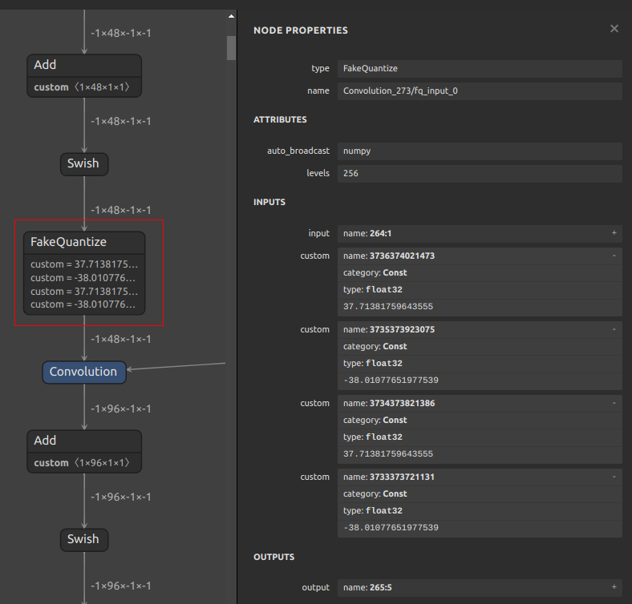
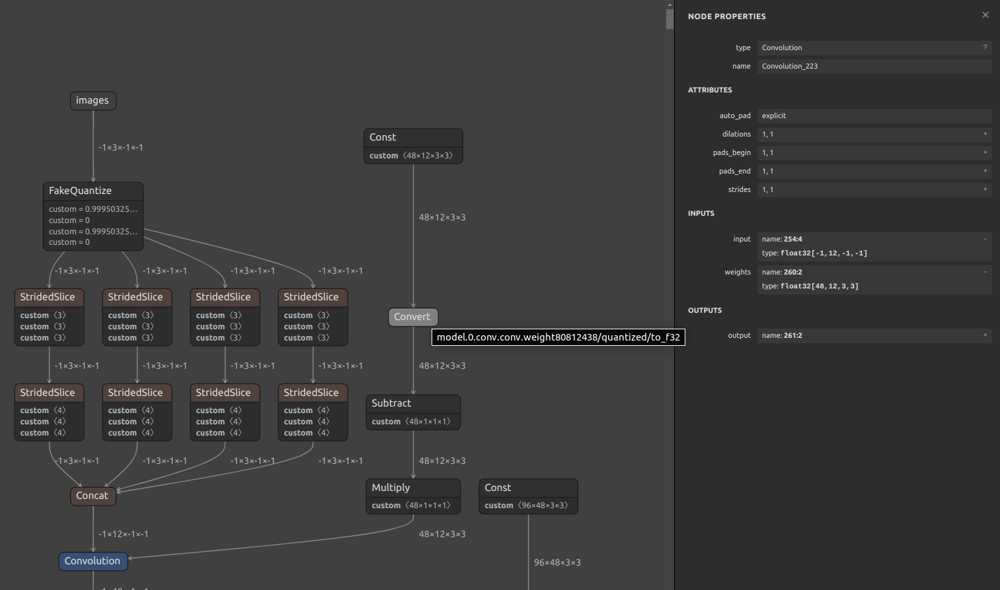
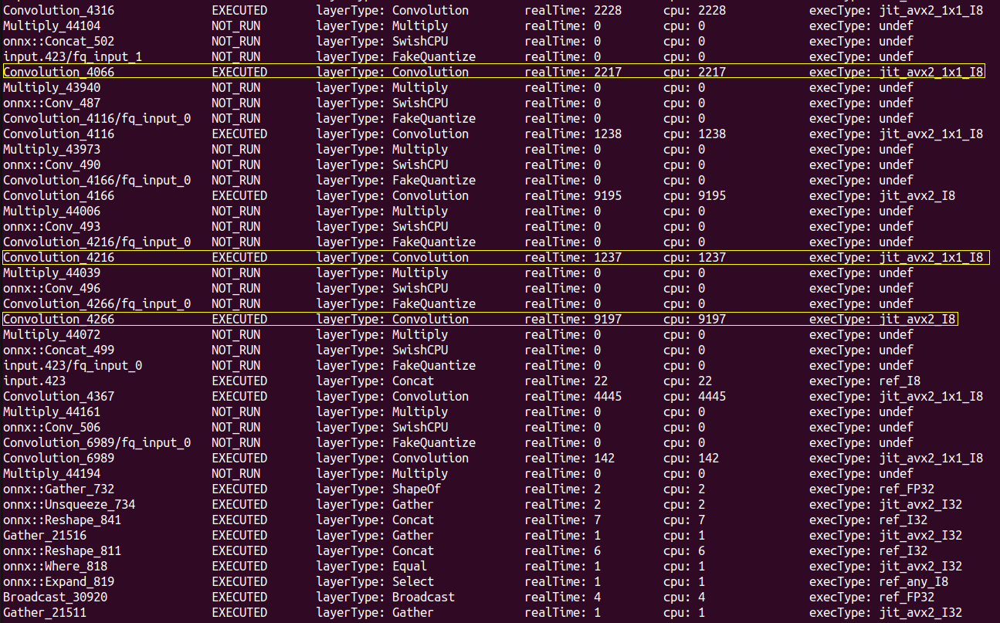
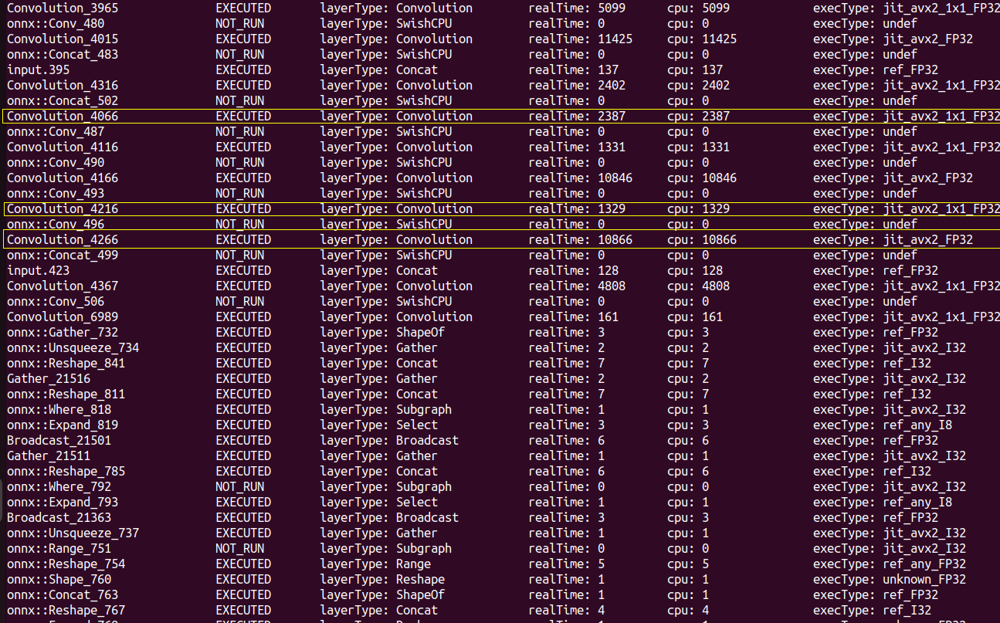

# OpenVINO Quantization Details

This document describes the inner workings of the OpenVINO quantization tool. You might not need to read this document if you are just using the tool. However, if you are interested in the details, this document is for you. 

First the math behind the quantization will be introduced. Then actual implementation details will be discussed. Also several references will be provided throughout the document for further reading. 

Note that only `DefaultQuantization` and `AccuracyAwareQuantization` are discussed in this document.


**Contents:**

+ [Introduction](#introduction)
+ [Math behind the quantization](#math-behind-the-quantization)
    + [Symmetric quantization](#symmetric-quantization)
    + [Asymmetric quantization](#asymmetric-quantization)
+ [Implementation details](#implementation-details)
    + [Low Precision Transformations](#low-precision-transformations)
___

## Introduction
In quantization we are interested in representing a real number (FP32 in computer) with a finite (smaller) number of bits. The purpose of quantization is to reduce the number of bits that are used for representing numbers. This helps reducing the memory footprint of the model and helps increasing the inference speed. For example, in extreme case, instead of multiplying two 32 bit floating point numbers, we can multiply two 8 bit integers. The integer multiplicatio is way more efficient and faster than the floating point multiplication. In general, quantization can be done during model training and during model inference. In this document we are interested in quantizing the model during inference. For more information on quantization techniques and methods, please refer to [this whitepaper](https://www.intel.com/content/www/us/en/developer/articles/technical/lower-numerical-precision-deep-learning-inference-and-training.html). 

Note that by quantizing the model, we are trading off accuracy for speed and memory footprint. So, it's essential to find the right balance between accuracy and speed/memory footprint. 

Quantization techniques have been widely used in other fields such as signal processing and image processing. In this document we are interested in quantizing the weights and activations of the neural network. Plus, this document is focused on OpenVINO framework and its quantization tool. 

## Math behind the quantization
In this section we will discuss the math behind the quantization. We will start with symmetric quantization and then move to asymmetric quantization. This section is based on [OpenVINO doc](https://docs.openvino.ai/2020.4/pot_compression_algorithms_quantization_README.html).

In quantization algorithms, a specific range of input values ($[a, b]$) is mapped to a predefined range of output values ($[c, d]$). The mapping is usually linear but can be non-linear as well. Consider the following example:
+ **example:** We have 8 bits to represent a number (random variable) that can take values between -1 and 2. We want to map this range to the range of 8-bit unsigned integers (0-255).

The example shows the purpose of quantization. There are many ways to map the input range to the output range. The most common way is to use linear mapping. In linear mapping, the input range is divided into $2^n$ equal intervals. Then for each interval, a number is assigned to it. In OpenVINO, the mapping is done as follows:
```math
$$
\begin{align*}
&\mathrm{output} = \frac{\mathrm{round}((\mathrm{clamp}(input, input\_low, input\_high) - input\_low)*s) }{s} + input\_low \\
&\mathrm{clamp}(input, input\_low, input\_high) = min(max(input, input\_low), input\_high) \\
&s = \frac{\mathrm{levels}-1}{input\_high - input\_low} \\
\end{align*}
$$
```
And $\mathrm{levels}$ specifies the number of quantization levels that can be represented. For example, if we have 8 bits, $\mathrm{levels} = 2^8 = 256$. 

OpenVINO supports two types of quantization modes: symmetric and asymmetric. In symmetric mode, the floating-point zero is quantized to the integer zero. However, in asymmetric mode, the floating-point zero is not necessarily quantized to the integer zero and it can be any integer number. But, in both modes, the floating-point zero is mapped directly to the quant witout any rounding.

### Symmetric quantization
In this method, $input\_low$ and $input\_high$ are computed as follows:
```math
$$
\begin{align*}
input\_low &= scale * \frac{level\_low}{level\_high} \\
input\_high &= scale \\
\end{align*}
$$
```
$scale$ parameters is tuned during the quantization process. $level\_low$ and $level\_high$ are the lowest and highest quantization levels respectively. So, for quantizing neural network parameters the following values are used:
+ For weights:
    ```math
    $$
    \begin{align*}
    level\_low &= -2^{bits-1}+1 \\
    level\_high &= 2^{bits-1}-1 \\
    levels &= 2^{bits}-1
    \end{align*}
    $$
    ```
+ For unsigned activations:
    ```math
    $$
    \begin{align*}
    level\_low &= 0 \\
    level\_high &= 2^{bits}-1 \\
    levels &= 2^{bits}
    \end{align*}
    $$
    ```
+ For signed activations:
    ```math
    $$
    \begin{align*}
    level\_low &= -2^{bits-1} \\
    level\_high &= 2^{bits-1}-1 \\
    levels &= 2^{bits}
    \end{align*}
    $$
    ```
Which $bits$ is the number of quantization bits (e.g. 8 bits).

### Asymmetric quantization
In asymmetric quantization, $input\_low$ and $input\_range$ are tuned druing the quantization process. For 8 bits quantization, the following values are used:
```math
$$
\begin{align*}
input\_high &= input\_low + input\_range \\
levels &= 256
\end{align*}
$$
```
And for weights and activations, the following values are used:
```math
$$
\begin{align*}
input\_low' &= min(input\_low, 0) \\
input\_high' &= max(input\_high, 0) \\
ZP &= \mathrm{round}\left(\frac{-input\_low' * (levels-1)}{input\_high' - input\_low'}\right) \\
input\_high'' &= \frac{ZP-levels+1}{ZP} * input\_low' \\
input\_low'' &= \frac{ZP}{ZP-levels+1} * input\_high' \\
input\_low, input\_high &= \begin{cases}
input\_low', input\_high', \quad ZP \in \{0, levels-1\} \\
input\_low', input\_high'', \quad input\_high''-input\_low' > input\_high'-input\_low'' \\
input\_low'', input\_high', \quad input\_high'' - input\_low' \leq input\_high'-input\_low'' \\
\end{cases}
\end{align*}
$$
```
## Implementation details
This section surveys the datils of the quantization process. Along with the OpenVINO documentation, I will also add my findings and experiments. 

OpenVINO inserts `FakeQuantize` layers into the model. During quantization, `FakeQuantize` parameters are fine tuned to meet accuracy requirements. `FakeQuantize` is element-wise **linear** quantization of floating-point input values into a discrete set of floating-point values. Fake in `FakeQuantize` stands for the fact that the output of this layer is floating point and not integer. The following snippet shows how `FakeQuantize` works:
```python
if x <= min(input_low, input_high):
    output = output_low
elif x > max(input_low, input_high):
    output = output_high
else:
    # input_low < x <= input_high
    output = round((x - input_low) / (input_high - input_low) * (levels-1)) / (levels-1) * (output_high - output_low) + output_low    
```

As mentioned in [Math behind quantization](#math-behind-the-quantization) section, there are four parameters that specify quantization: `input_low`, `input_high`, `output_low`, `output_high`. Any value outside this range is clipped (saturated) to the nearest bound. `FakeQuantize` class has the following parameters:
+ **Attributes:**
    + `levels`: Quantization levels, 2 for binarization, 255 or 256 for int8 quantization
    + `auto_broadcast`: specifies ruls used for auto-broadcasting of input parameters (none, numpy or pdpd)
+ **Inputs:**
    + 1: `X` - input tensor of type *T_F*
    + 2: `input_low` - tensor with type *T_F* that specifies lower bound of the quantization range for input (must be broadcastable to the shape of `X`)
    + 3: `input_high` - just like `input_low` but specifies upper bound of the quantization range for input
    + 4: `output_low`: tensor with type *T_F* that specifies lower bound of the quantization range for output (must be broadcastable to the shape of `X`)
    + 5: `output_high`: just like `output_low` but specifies upper bound of the quantization range for output
+ **Outputs:**
    + 1: output tensor of type *T_F* with the same shape as input tensor

An example of `FakeQuantize` layer is shown below (from Fire and Smoke Detection model, yolov5):

```xml
<layer id="265" name="Convolution_273/fq_input_0" type="FakeQuantize" version="opset1">
    <data levels="256" auto_broadcast="numpy"/>
    <input>
        <port id="0">
            <dim>-1</dim>
            <dim>48</dim>
            <dim>-1</dim>
            <dim>-1</dim>
        </port>
        <port id="1"/>
        <port id="2"/>
        <port id="3"/>
        <port id="4"/>
    </input>
    <output>
        <port id="5" precision="FP32">
            <dim>-1</dim>
            <dim>48</dim>
            <dim>-1</dim>
            <dim>-1</dim>
        </port>
    </output>
</layer>
```
This image shows the same `FakeQuantize` layer in the model (Netron):


**Note:** It seems to me that the parameters drawn in Netron are not correct in comparison to the parameters of `FakeQuantize` class. Because, for instance, the second input of `FakeQuantize` is `input_low` and the third one is `input_high`. However, in this image, it seems that they are reversed (not sure about this).

The parameters of `FakeQuantize` layer are tuned during the quantization process. In [Optimization Guide](./optimization-guide.md) document, the process of running the quantization is described. 

It might seem that this `FakeQuantize` layer is no useful. For example, consider the following part of the model (visualized with Netron):


And the corresponding part of the model in `.xml` file:
```xml
<layer id="255" name="model.0.conv.conv.weight80812438/quantized1616923111" type="Const" version="opset1">
    <data offset="664" size="5184" shape="48,12,3,3" element_type="i8"/>
    <output>
        <port id="0" precision="I8">
            <dim>48</dim>
            <dim>12</dim>
            <dim>3</dim>
            <dim>3</dim>
        </port>
    </output>
</layer>
<layer id="256" name="model.0.conv.conv.weight80812438/quantized/to_f32" type="Convert" version="opset1">
    <data destination_type="f32"/>
    <input>
        <port id="0">
            <dim>48</dim>
            <dim>12</dim>
            <dim>3</dim>
            <dim>3</dim>
        </port>
    </input>
    <output>
        <port id="1" precision="FP32">
            <dim>48</dim>
            <dim>12</dim>
            <dim>3</dim>
            <dim>3</dim>
        </port>
    </output>
</layer>
<layer id="257" name="Convolution_223/fq_weights_1/zero_point1618822487" type="Const" version="opset1">
    <data offset="5848" size="192" shape="48,1,1,1" element_type="f32"/>
    <output>
        <port id="0" precision="FP32">
            <dim>48</dim>
            <dim>1</dim>
            <dim>1</dim>
            <dim>1</dim>
        </port>
    </output>
</layer>
<layer id="258" name="Convolution_223/fq_weights_1/minus_zp" type="Subtract" version="opset1">
    <data auto_broadcast="numpy"/>
    <input>
        <port id="0">
            <dim>48</dim>
            <dim>12</dim>
            <dim>3</dim>
            <dim>3</dim>
        </port>
        <port id="1">
            <dim>48</dim>
            <dim>1</dim>
            <dim>1</dim>
            <dim>1</dim>
        </port>
    </input>
    <output>
        <port id="2" precision="FP32">
            <dim>48</dim>
            <dim>12</dim>
            <dim>3</dim>
            <dim>3</dim>
        </port>
    </output>
</layer>
<layer id="259" name="Convolution_223/fq_weights_1/scale1617721362" type="Const" version="opset1">
    <data offset="6040" size="192" shape="48,1,1,1" element_type="f32"/>
    <output>
        <port id="0" precision="FP32">
            <dim>48</dim>
            <dim>1</dim>
            <dim>1</dim>
            <dim>1</dim>
        </port>
    </output>
</layer>
<layer id="260" name="Convolution_223/fq_weights_1/mulpiply_by_scale" type="Multiply" version="opset1">
    <data auto_broadcast="numpy"/>
    <input>
        <port id="0">
            <dim>48</dim>
            <dim>12</dim>
            <dim>3</dim>
            <dim>3</dim>
        </port>
        <port id="1">
            <dim>48</dim>
            <dim>1</dim>
            <dim>1</dim>
            <dim>1</dim>
        </port>
    </input>
    <output>
        <port id="2" precision="FP32">
            <dim>48</dim>
            <dim>12</dim>
            <dim>3</dim>
            <dim>3</dim>
        </port>
    </output>
</layer>
<layer id="261" name="Convolution_223" type="Convolution" version="opset1">
    <data auto_pad="explicit" strides="1,1" dilations="1,1" pads_begin="1,1" pads_end="1,1"/>
    <rt_info>
        <attribute name="fused_names" version="0" value="Convolution_223"/>
    </rt_info>
    <input>
        <port id="0">
            <dim>-1</dim>
            <dim>12</dim>
            <dim>-1</dim>
            <dim>-1</dim>
        </port>
        <port id="1">
            <dim>48</dim>
            <dim>12</dim>
            <dim>3</dim>
            <dim>3</dim>
        </port>
    </input>
    <output>
        <port id="2" precision="FP32">
            <dim>-1</dim>
            <dim>48</dim>
            <dim>-1</dim>
            <dim>-1</dim>
        </port>
    </output>
</layer>
```
If you investiage the `Convolution` layer in image and the graph, you would notice something strange. I'll explain my findings and the issue. 

As you can see, the `const` layer shows the input weights of the convolution layer. It's quantized and is represented in int8 format. However, after the `const` layer, there is a `convert` layer that converts the weights to FP32. This is strange and questiones the usefulness of the `FakeQuantize` layer. Also the input of convolution layer is FP32 and the output is also in FP32 format. So, why do we need to quantize the weights? It seems that quantizing only helps to reduce the time to load the weights into the memory and CPU registers (which can help to speed up the inference). However, the inference itself is still done in FP32 format. 

After this observation, I checked running the same Fire and Smoke Detection model (yolov5-based) to see if operations are running in FP32 or I8 and the result was interesting. If you check whole `.xml` file you would see that only loading weights from `.bin` file into `const` layers are int `I8` precision. I run the model with `benchmark_app` with the following command:
```bash
$ ./benchmark_app -hint throughput -d CPU -m [path to quantized model.xml] -data_shape "[1,3,640,480]" -ip u8 -op u8 -pc
```
I run the `cpp` version of `benchmark_app` but you can run it with `Python` app. The full result file is int [here](./results/benchmark-app-res-quan.txt). Feel free to investiage it. I only provide some insights into the result. Consider the following parts of the result:


As you can see there are convolution operatinos that run in I8 format, using AVX2 operations. This operations are provided in oneDNN library and OpenVINO uses internally. Also the result of running the unquantized model (FP32) is provided in [this file](./results/benchmark-app-res-fp32.txt). You can see the same part of the result in the following image:


As you can see, in FP32 version, the convolution operations are running in FP32 format which is expected. But, accroding to our observation, `FakeQuantize` layer still converts the weights to FP32 format. So, why I8 operations are running? The answer is in [Low Precision Transformations of OpenVINO](https://docs.openvino.ai/latest/openvino_docs_OV_UG_lpt.html). This is an advanced topic of OpenVINO for developers. But, it's necessary to understand the topic to get the answer.

### Low Precision Transformations
According to OpenVINO doc:
> Low precision transformations (known as LPT) are a set of nGraph transformations, which are combined in one library. The library is mandatory part of OpenVINO to infer quantized model in low precision with the maximum performance on Intel CPU, GPU and ARM platforms. The library includes more than 45 transformations and supports more then 30 operations. Some transformations are mandatory, some of them are optional and developed for specific device.

The purpose of LPT is to transform the original model from FP32 or FP16 to a low precision model to be run on devices with low precision capabilities. LPT runs during runtime and that's why it's not visible in the `.xml` file. The reason for that is to dynamically adjust the model to the current device. This document won't discuss the details of LPT and only a high level overview is provided. For more information refer to [OpenVINO doc](https://docs.openvino.ai/latest/openvino_docs_OV_UG_lpt.html). 

This procedure is done in two steps:
1. `FakeQuantize` operations is decomposed to two parts:
    + first part is a new `FakeQuantize` operation with output quantization intervals in low precision range (quantize operation)
    + second part is a dequantization operation with low precision input and original output 
2. Propagation of the dequantization operaiton trhough original model's operations. 

As a result of these steps, the model can be inferenced in low precision format by OpenVINO plugin. 

A full list of operations that dequantization operation is propagated through is provided in [this document](https://docs.openvino.ai/latest/openvino_docs_OV_UG_lpt.html#input-model-requirements). If the dequantization operation cannot be propagated through the operation, the original precision of the operation is used. 