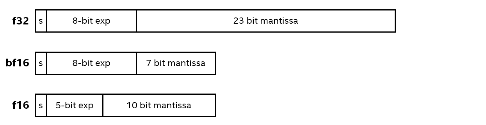
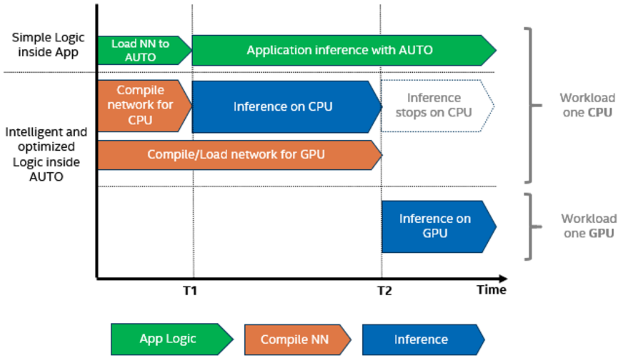

# OpenVINO Optimization Guide

Valuable tools are provided within OpenVINO environment to help data scientists and developers to optimize their models. In this guide, I summarize these techniques and investigate their benefits. All information gathered in this guide are derived from the [OpenVINO documentation](https://docs.openvino.ai/latest/documentation.html). For more information, please refer to the official documentation.

**Contents:**

+ [Model Optimizer](#model-optimizer)
+ [Deploying with OpenVINO Runtime](#deploying-with-openvino-runtime)
+ [Working with Devices](#working-with-devices)
+ [Tuning for Performance](#tuning-for-performance)
___
## Model Optimizer
Model optimizer is used to convert the AI models to OpenVINO IR format. IR stands for intermediate representation. Every converted model is consisted of (at least) two files: 1) `.xml` file which contains the network topology and 2) `.bin` file which contains the weights of the network. Later, OpenVINO runtime loades the IR files and executes the model. 

**Note:** Although the OpenVINO runtime can run `.onnx` models directly, but it is recommended to convert the models to IR format as some further optimizations are applied to the IR models.

The details of how to convert the models with model optimizer are not covered in this guide. However, I would mention some important parameters and tips that could help optimizing models further.

### Tips and Notes:
1. **Static shape:** 

    It's better to use static shapes instead of dynamic shapes. If the input shape is not going to change in consecutive runs, then it's better to use static shapes. The reason is that static shapes helps using the same allocated memory multiple times and also simple operators will be used in OpenVINO runtime engine (instead of very general operatorss).
    Even if the input shape changes but there is a lower and upper bound on the dimmensions, it is recommended to provide the ranges (especially upper bound).

    There are two methods to make inputs of the model static: 1) with model optimizer (`mo`), 2) with OpenVINO runtime. 
    + model optimizer: 
        ```bash
        $ mo --input_model face-det.onnx --input images --input_shape [1,3,640,480]
        ```
    + OpenVINO runtime:
        ```cpp
        ov::Core core;
        auto m = core.read_model("model.xml");    
        m->reshape({1, 3, 640, 480});        
        ```
    Note that when you are making the inputs static using model optimizer, you won't be able to change the input shape later. However, OpenVINO runtime allows you to change the input shape before compiling it for a specific device.
2. **Embedding Preprocessing Computation:**

    Almost all AI models require some pre- and post-processings. For example, in image classification models, the input image is resized and normalized before feeding it to the model. However, these routines are not a part of the model itself. So, if you convert a Pytorch model and later you wanna use it in OpenVINO runtime in C++, you should implement the preprocessing routines in C++ as well. It might not be a big deal but suppose you need to run the processing routines on GPU. Then you should rewrite whole functions. 

    By embedding the preprocessing routines into the model, you can avoid this problem. Plus, you can benefit other optimizations as well. For example, hybrid runtime would help you to run part of preprocessing on other devices. So, it is recommended to embedd preprocessing routines into the model. The preprocessing API will not be covered in detail in this guide. So, refer to [this](https://docs.openvino.ai/latest/openvino_docs_MO_DG_Additional_Optimization_Use_Cases.html) for more information.

3. **Compression of a Model to FP16:**

    By compressing the model to FP16 you can reduce the model size. This compression would not affect the accuracy of the model that much and is recommended before quantizing model to INT8. Note that the inference will not be in FP16 format unless you have a device that supports bfloat16 format. For more information about hardware support, refer to [this](#working-with-devices) section of this document.

___
## Deploying with OpenVINO Runtime
This section covers the deployment of the models with OpenVINO runtime. My focus is on the C++ API of OpenVINO runtime. However, the Python API is very similar and will not be discussed here. Plus, I only mention tips that will help to improve the performance of the model. For more information, refer to the [official documentation](https://docs.openvino.ai/latest/openvino_docs_OV_UG_Integrate_OV_with_your_application.html). 

### Tips and Notes:
1. **Inference request:**

    After compiling model for a specific hardware, an "inference request" is created and then it will be used for running inference and getting results. Basically the inference request is run in two mode: 1) Synchrounous, 2) Asynchronous. In synchronous mode, the inference request will wait until the inference is done and then return the results. In asynchronous mode, the inference request will return immediately and the results will be available later. You can choose to wait for asynchronous inference or set a callback that will be run when the inference is done. Following snippet shows the usage of synchronous and asynchronous mode:
    ```cpp
    ov::InferRequest infer_request = compiled_model.create_infer_request();
    // 1) synchronous execution
    infer_request.infer();
    // 2-1) asynchronous with callback
    infer_request.set_callback([&](std::exception_ptr ex_ptr){
        if(!ex_ptr){
            // inference is done and output data can be processed
            std::cout << "Inference is done!\n";
        } else {
            std::cout << "Something went wrong!\n";
        }
    });
    // 2-2) asynchronous with waiting
    infer_request.start_async();
    infer_request.wait();
    ```
    You can also set the exact waiting time with `wait_for` function. The duration specifies the blocking time of `infer_request` method. Using asynchronous mode is recommended and you can run other tasks while the inference is running. 

___
## Working with Devices
OpenVINO can be used with a wide range of hardware. The following table from [OpenVINO documentation](https://docs.openvino.ai/latest/openvino_docs_OV_UG_Working_with_devices.html) shows the supported device types:

|Plugin|Device type|
|:-:|:-:|
CPU | Intel® Xeon®, Intel® Core™ and Intel® Atom® processors with Intel® Streaming SIMD Extensions (Intel® SSE4.2), Intel® Advanced Vector Extensions 2 (Intel® AVX2), Intel® Advanced Vector Extensions 512 (Intel® AVX-512), Intel® Vector Neural Network Instructions (Intel® AVX512-VNNI) and bfloat16 extension for AVX-512 (Intel® AVX-512_BF16 Extension)
GPU|Intel® Graphics, including Intel® HD Graphics, Intel® UHD Graphics, Intel® Iris® Graphics, Intel® Xe Graphics, Intel® Xe MAX Graphics
VPUs|Intel® Neural Compute Stick 2 powered by the Intel® Movidius™ Myriad™ X, Intel® Vision Accelerator Design with Intel® Movidius™ VPUs
GNA|Intel® Speech Enabling Developer Kit ; Amazon Alexa* Premium Far-Field Developer Kit ; Intel® Pentium® Silver Processors N5xxx, J5xxx and Intel® Celeron® Processors N4xxx, J4xxx (formerly codenamed Gemini Lake) : Intel® Pentium® Silver J5005 Processor , Intel® Pentium® Silver N5000 Processor , Intel® Celeron® J4005 Processor , Intel® Celeron® J4105 Processor , Intel® Celeron® J4125 Processor , Intel® Celeron® Processor N4100 , Intel® Celeron® Processor N4000 ; Intel® Pentium® Processors N6xxx, J6xxx, Intel® Celeron® Processors N6xxx, J6xxx and Intel Atom® x6xxxxx (formerly codenamed Elkhart Lake) ; Intel® Core™ Processors (formerly codenamed Cannon Lake) ; 10th Generation Intel® Core™ Processors (formerly codenamed Ice Lake) : Intel® Core™ i7-1065G7 Processor , Intel® Core™ i7-1060G7 Processor , Intel® Core™ i5-1035G4 Processor , Intel® Core™ i5-1035G7 Processor , Intel® Core™ i5-1035G1 Processor , Intel® Core™ i5-1030G7 Processor , Intel® Core™ i5-1030G4 Processor , Intel® Core™ i3-1005G1 Processor , Intel® Core™ i3-1000G1 Processor , Intel® Core™ i3-1000G4 Processor ; 11th Generation Intel® Core™ Processors (formerly codenamed Tiger Lake) ; 12th Generation Intel® Core™ Processors (formerly codenamed Alder Lake)
Arm® CPU|Raspberry Pi™ 4 Model B, Apple® Mac mini with M1 chip, NVIDIA® Jetson Nano™, Android™ devices

More information about each device is provided in the following sub sections:
<details>
    <summary><strong>CPU</strong></summary>
&nbsp SSE stands for streaming SIMD extensions. As its name suggests, SSE enables Intel CPUs (and AMD) to execute SIMD operations. SSE2 was introduced in 2000 with the Pentium 4 processor. Later on, SSE3, SSE4.2 and AVX were added to different generations of Intel CPUs. Almost all x86 CPUs support SSE2 and almos all generations of core i3,5, and 7, support SSE4.2.

&nbsp AVX is an extension to x86 ISA that enables running one instruction on multiple data (SIMD). AVX by default enables 256-bit vector registers. With that you can run operations on eight 32-bit registers or four 64-bit registers. AVX was introduced back in 2008. AVX2 extends more integer operation to 256 bits and was introduced in 2013. AVX-512 extends operations to 512 bits registers.

If you wanna find out if your CPU supports this plugins or not, refer to [Intel website](https://www.intel.com/content/www/us/en/products/details/processors.html) and find your CPU. 
</details>
<details>
    <summary><strong>VPU</strong></summary>
&nbsp VPU is a special hardware that can be used along with CPU to run inference. For instance, Intel® Neural Compute Stick 2 comes in the form of a USB stick and can be connected to a computer or even a Raspberry Pi. 
</details>
<details>
    <summary><strong>GNA</strong></summary>
&nbsp GNA is a special hardware inside the CPU that can help to run inference. It's like a co-processor and is added mostly in 10, 11 and 12 generation Intel® CPUs.
</details>
<details>
    <summary><strong>ARM CPU</strong></summary>
&nbsp Arm CPU support is added through OpenVINO community. So, it is not officially supported by Intel. However, it is possible to use OpenVINO with Arm CPU. 
</details>
  
OpenVINO offers various capability to work with devices. The following feature table shows the supported features for each device type:

|Capability|[CPU](#cpu-plugin-capabilities)|[GPU](#gpu-plugin-capabilities)|[GNA](#gna-plugin-capabilities)|Arm CPU|Description|
|:-:|:-:|:-:|:-:|:-:|:-:|
Heterogeneous execution|Yes|Yes|No|Yes| Enables automatic inference splitting between several devices|
Multi-device execution|Yes|Yes|Partial|Yes| Running inference of the same model on several devices in parallel|
Automatic batching|No|Yes|No|No| Enables input batching that is completely transparent to the user|
Multi-stream execution|Yes|Yes|No|Yes| 
Models caching|Yes|Partial|Yes|No|
Dynamic shapes|Yes|Partial|No|No| Input dynamic shape that enables input to be of different sizes|
Import/Export|Yes|No|Yes|No
Preprocessing acceleration|Yes|Yes|No|Partial
Stateful models|Yes|No|Yes|No
Extensibility|Yes|Yes|No|No

Next the capabilities of each device is explained in detail in the following sub sections:

### CPU Plugin Capabilities
CPU plugin supports the following datatypes as inference precision:

- f32 (float)
- bf16 (bfloat16)
- i32 (int)
- u8 (quantized datatype)
- i8 (quantized datatype)
- u1 (quantized datatype)

By default OpenVINO Runtime uses f32 as inference precision. So, FP16 models will be converted to FP32 internally. However, if CPU supports `bfloat16` natively (devices that have `AVX512_BF16` extension), the `bfloat16` precision will be used automatically. The following image shows the difference between FP32, FP16 and BF16:


CPU plugin supports the following features:
1. [Multi-device execution](#multi-device-execution):
    ```cpp
    ov::Core core;
    auto model = core.read_model("model.xml");
    auto compiled_model = core.compile_model(model, "MULTI:CPU,GPU.0");
    ```
2. [Multi-stream execution](#multi-stream-execution): if number of streams is more than 1, either by using `ov::num_streams(n_streams)`, or `ov::hint::performance_mode(ov::hint::PerformanceMode::THROUGHPUT)`, it will create multiple threads to run inference. More information about that will be explained in [Tuning for Performance](#tuning-for-performance) section. 
3. Dynamic Shapes: Fully supported
4. Preprocessing acceleration: Fully supported
5. [Model Chaching](#model-caching): Fully supported - This mechanism helps reducing the time needed to load the model to the device in later runs. 
6. Extensibility: Fully supported - One can define her own operations and use them along with OpenVINO operations.
7. Stateful models: Fully supported

### GPU Plugin Capabilities
GPU plugin supports the following the following datatypes as inference precision:
+ f32 (float)
+ f16 (float)
+ u8 (quantized datatype)
+ i8 (quantized datatype)
+ u1 (quantized datatype)

Also following features are supported by GPU plugin:
1. [Multi-device execution](#multi-device-execution): If system has multiple GPUs, the model can be run on all of them simultaneously.
    ```cpp
    ov::Core core;
    auto model = core.read_model("model.xml");
    auto compiled_model = core.compile_model(model, "MULTI:GPU.1,GPU.0");    
    ```
2. Automatich batching: When throughput hint is used, the automatic batching is enabled. Also you can enable automatic batching via explicit "BATCH" options:
    ```cpp
    ov::Core core;
    auto model = core.read_model("model.xml");
    auto compiled_model = core.compile_model(model, "BATCH:GPU");    
    ```
3. [Multi-stream execution](#multi-stream-execution): Fully supported
4. Dynamic shapes: Only dynamic shape for batch is supported and user needs to provide a upper bound for the batch size (specified as `N` in layout terms). 
5. Preprocessing acceleration: Fully supported
6. [Model Chaching](#model-caching): Can help reduce startup time of the model inference (i.e. compiling the model for GPU device). 
7. Extensibility: Fully supported

To use GPU plugin effectively, more needs to be done. This document will not cover every detail of GPU plugin. However, [this link](https://docs.openvino.ai/latest/openvino_docs_OV_UG_supported_plugins_GPU.html) can be useful.

### VPU Plugin Capabilities
VPU plugin is pretty limited to be used with different networks. Plus, it is not interesting to us as of writing this document. So, we will not cover it in detail. However, [this link](https://docs.openvino.ai/latest/openvino_docs_OV_UG_supported_plugins_VPU.html) can be useful.

### GNA Plugin Capabilities
As mentioned earlier, GNA is a low-power neural network coprocessor inside Intel CPUs. Note that it is not supposed to be used in place of CPU itself, rather it's designed to offload continous tasks such as speech recognition and noise reduction to it. By doing so, the CPU can be used for other tasks and lower power will be consumed. 

The first and second version of GNA were added in 10th and 11th generation Intel® CPUs. The third version was added in 12th generation Intel® CPUs. The GNAs are not backward comptabile. Currently it's quite limited in its features. So, it won't be discussed in this document. More information about GNA can be found [here](https://docs.openvino.ai/latest/openvino_docs_OV_UG_supported_plugins_GNA.html).


[This link](https://docs.openvino.ai/latest/openvino_docs_OV_UG_supported_plugins_Supported_Devices.html) summarizes all the supported devices and their capabilities.

Next some capabilities are explained in detail:

### Automatic Device Selection
Automatic device selection aims to select the best device for inference, based on the current hardware. By using that, the user doesn't need to know which device is the best for her model and bind it to that device. The rationale behind this is as follows:

1. First checks what devices are available in the system.
2. Then precision of the model is checked 
3. After that, highest priority device is selected to run inference on
it.

"AUTO" always starts inference with CPU, since it offers lowest latency possible. In the same time, model is being compiled for other devices (GPU for instance). That helps reducing startup time of the model inference. For later inference cycles, GPU is used for inference as it offers better throughput (if needed). Following figure summarizes the process:



### Multi-device Execution
Multi-device execution provides the abstraction of a virtual device that is composed of multiple physical devices. So, when there is an inference request, "MULTI" assigns it automatically to a particular device that is available at the moment. Then all the inference requests are run in parallel.

One benefit of using "MULTI" is the improvement in throughput. Another benefit is that it increases performance stability. Plus, user doesn't need to handle any details of the physical devices (for instance compiling for different devices) and OpenVINO takes care of that internally. 

Note that the performance gain is only visible if there are multiple inference requests so that the devices are always busy. Otherwise, there wouldn't be so much gain. 

You can change the priority of the devices at any time. For more information about "MULTI", pleaser refer to [this](https://docs.openvino.ai/latest/openvino_docs_OV_UG_Running_on_multiple_devices.html).

### Multi-stream Execution
It's more beneficial to run inference requests asynchronously. Each device in OpenVINO has a queue of inference requests. The device may process multiple inference requests in parallel. User can control the number of parallel requests by setting the number of streams.

### Model Caching
Compiling a model for a device is a time consuming task. So, it's better to do it once and reuse it later. Model caching is a mechanism that helps reducing the time needed to load the model to the device in later runs. So, it helps reducing startup time of the model inference. By setting `cache_dir` config option you can enable model caching. 

If device supports import/export mechanism, the compiled model is saved to the specified directory and can later be reused. If device doesn't support import/export mechanism, the original model will be used and **no** error will be thrown.
___
## Tuning for Performance
