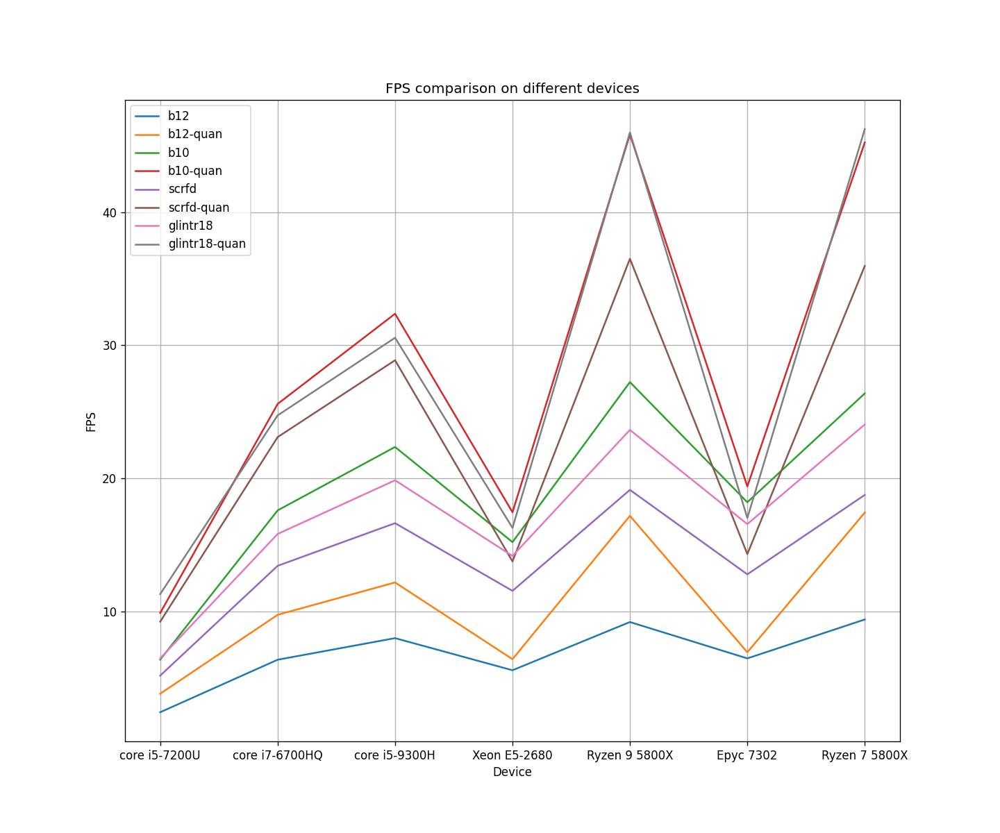
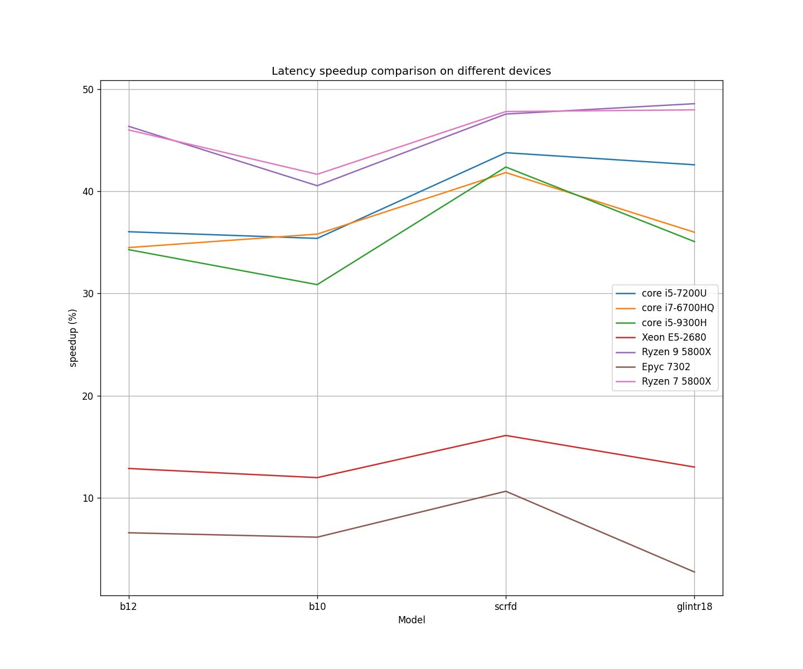

# Timing Benchmarks
I've run timing benchmarks to compare the benifits of quantizing models with `pot` default quantization method. 

The following table shows important CPU features of each system:

|Index|CPU model|Features|IP address|
|:--:|:--:|:---:|:---:|
|1|Core i5-7200U @ 2.50GHz|SSE4_2<br>AVX2|127.0.0.1|
|2|Core i7-6700HQ @ 2.60 GHz | SSE4_2<br>AVX2| 127.0.0.1 |
|3|Core i5-9300H @ 2.40 GHz | SSE4_2<br>AVX2| 127.0.0.1 |
|4|Xeon E5-2680 v4 @ 2.40GHz|SSE4_2<br>AVX2|213.233.161.119|
|5|Ryzen 9 5800X|SSE4_2<br>AVX2| 213.233.181.171 |
|6|Epyc 7302 | SSE4_1<br>SSE4a<br>AVX2 | 213.233.181.155 |
|7|Ryzen 7 5800X|SSE4_2<br>SSE4a<br>AVX2| 213.233.181.172 |

<br>

## Results:

<table style="text-align:center">
    <thead>
        <tr>
			<th rowspan=2>Model</th>
            <th colspan=2><center>laptop<br>(Core i5-7200U  @ 2.50GHz)</center></th>
			<th colspan=2><center>laptop<br>(Core i7-6700HQ  @ 2.60GHz)</center></th>
			<th colspan=2><center>laptop<br>(Core i5-9300H  @ 2.40GHz)</center></th>
            <th colspan=2><center>Server<br>(Xeon E5-2680 v4 @ 2.40GHz)</center></th>
			<th colspan=2><center>Server<br>(Ryzen 9 5800X)</center></th>
			<th colspan=2><center>Server<br>(Epyc 7302)</center></th>
			<th colspan=2><center>Server<br>(Ryzen 7 5800X)</center></th>
        </tr>
		<tr>
			<th><center>FPS<br>(avg)</center></th>
			<th><center>Latency<br>(ms)</center></th>
			<th><center>FPS<br>(avg)</center></th>
			<th><center>Latency<br>(ms)</center></th>
			<th><center>FPS<br>(avg)</center></th>
			<th><center>Latency<br>(ms)</center></th>
			<th><center>FPS<br>(avg)</center></th>
			<th><center>Latency<br>(ms)</center></th>
			<th><center>FPS<br>(avg)</center></th>
			<th><center>Latency<br>(ms)</center></th>
			<th><center>FPS<br>(avg)</center></th>
			<th><center>Latency<br>(ms)</center></th>
			<th><center>FPS<br>(avg)</center></th>
			<th><center>Latency<br>(ms)</center></th>
		</tr>
    </thead>
    <tbody>
		<tr>
			<td> b12 </td>
			<td> 2.46 </td>
			<td> 406.09</td>
			<td> 6.40 </td>
			<td> 156.16 </td>
			<td> 8.02 </td>
			<td> 124.66 </td>
			<td> 5.61 </td>
			<td> 178.29 </td>
			<td> 9.23 </td>
			<td> 108.27 </td>
			<td> 6.50 </td>
			<td> 153.67 </td>
			<td> 9.42 </td>
			<td> 106.15 </td>
		</tr>
		<tr>
			<td> b12-quan </td>
			<td> 3.85 </td>
			<td> 259.71 </td>
			<td> 9.77 </td>
			<td> 102.29 </td>
			<td> 12.20 </td>
			<td> 81.91 </td>
			<td> 6.44 </td>
			<td> 155.34 </td>
			<td> 17.20 </td>
			<td> 58.07 </td>
			<td> 6.96 </td>
			<td> 143.56 </td>
			<td> 17.44 </td>
			<td> 57.31 </td>
		</tr>
		<tr>
			<td> b10 </td>
			<td> 6.41 </td>
			<td> 156.09 </td>
			<td> 17.61 </td>
			<td> 56.68 </td>
			<td> 22.37 </td>
			<td> 44.64 </td>
			<td> 15.23 </td>
			<td> 65.54 </td>
			<td> 27.24 </td>
			<td> 36.67 </td>
			<td> 18.22 </td>
			<td> 54.82 </td>
			<td> 26.39 </td>
			<td> 37.87 </td>
		</tr>
		<tr>
			<td> b10-quan </td>
			<td> 9.91 </td>
			<td> 100.84 </td>
			<td> 25.60 </td>
			<td> 36.38 </td>
			<td> 32.37 </td>
			<td> 30.86 </td>
			<td> 17.47 </td>
			<td> 57.69 </td>
			<td> 45.82 </td>
			<td> 21.80 </td>
			<td> 19.41 </td>
			<td> 51.45 </td>
			<td> 45.23 </td>
			<td> 22.09 </td>
		</tr>
		<tr>
			<td> scrfd_10g_bnkps </td>
			<td> 5.21 </td>
			<td> 192.09 </td>
			<td> 13.45 </td>
			<td> 74.24 </td>
			<td> 16.65 </td>
			<td> 59.98 </td>
			<td> 11.57 </td>
			<td> 86.37 </td>
			<td> 19.15 </td>
			<td> 52.18 </td>
			<td> 12.81 </td>
			<td> 77.99 </td>
			<td> 18.77 </td>
			<td> 53.25 </td>
		</tr>
		<tr>
			<td> scrfd_10g_bnkps-quan </td>
			<td> 9.26 </td>
			<td> 107.99 </td>
			<td> 23.11 </td>
			<td> 43.18 </td>
			<td> 28.88 </td>
			<td> 34.56 </td>
			<td> 13.78 </td>
			<td> 72.46 </td>
			<td> 36.50 </td>
			<td> 27.36 </td>
			<td> 14.33 </td>
			<td> 69.69 </td>
			<td> 35.96 </td>
			<td> 27.79 </td>
		</tr>
		<tr>
			<td> glintr18 </td>
			<td> 6.51 </td>
			<td> 153.66 </td>
			<td> 15.84 </td>
			<td> 63.06 </td>
			<td> 19.87 </td>
			<td> 50.28 </td>
			<td> 14.19 </td>
			<td> 70.39 </td>
			<td> 23.65 </td>
			<td> 42.26 </td>
			<td> 16.58 </td>
			<td> 60.22 </td>
			<td> 24.06 </td>
			<td> 41.54 </td>
		</tr>
		<tr>
			<td> glintr18-quan </td>
			<td> 11.33 </td>
			<td> 88.20 </td>
			<td> 24.74 </td>
			<td> 40.36 </td>
			<td> 30.57 </td>
			<td> 32.64 </td>
			<td> 16.30 </td>
			<td> 61.23 </td>
			<td> 45.98 </td>
			<td> 21.73 </td>
			<td> 17.04 </td>
			<td> 58.57 </td>
			<td> 46.23 </td>
			<td> 21.61 </td>
		</tr>
    </tbody>
</table>

The following table shows the FPS and latency improvement value for each model on server and laptop:

<table style="text-align: center;">
    <thead>
        <tr>
			<th rowspan=2>Model</th>
            <th colspan=2><center>laptop<br>(Core i5-7200U  @ 2.50GHz)</center></th>
			<th colspan=2><center>laptop<br>(Core i7-6700HQ  @ 2.60GHz)</center></th>
			<th colspan=2><center>laptop<br>(Core i5-9300H  @ 2.40GHz)</center></th>
            <th colspan=2><center>Server<br>(Xeon E5-2680 v4 @ 2.40GHz)</center></th>
			<th colspan=2><center>Server<br>(Ryzen 9 5800X)</center></th>
			<th colspan=2><center>Server<br>(Epyc 7302)</center></th>
			<th colspan=2><center>Server<br>(Ryzen 7 5800X)</center></th>
        </tr>
		<tr>
			<th><center>FPS <br> improvement</center></th>
			<th><center>Latency <br> improvement</center></th>
			<th><center>FPS <br> improvement</center></th>
			<th><center>Latency <br> improvement</center></th>
			<th><center>FPS <br> improvement</center></th>
			<th><center>Latency <br> improvement</center></th>
			<th><center>FPS <br> improvement</center></th>
			<th><center>Latency <br> improvement</center></th>
			<th><center>FPS <br> improvement</center></th>
			<th><center>Latency <br> improvement</center></th>
			<th><center>FPS <br> improvement</center></th>
			<th><center>Latency <br> improvement</center></th>
			<th><center>FPS <br> improvement</center></th>
			<th><center>Latency <br> improvement</center></th>
		</tr>
    </thead>
    <tbody>
		<tr>
			<td> b12 </td>
			<td> 56.50% </td>
			<td> 36.05% </td>
			<td> 52.65% </td>
			<td> 34.50% </td>
			<td> 52.12% </td>
			<td> 34.30% </td>
			<td> 14.79% </td>
			<td> 12.87% </td>
			<td> 86.35% </td>
			<td> 46.36% </td>
			<td> 7.08% </td>
			<td> 6.57% </td>
			<td> 85.14% </td>
			<td> 46.01% </td>
		</tr>
		<tr>
			<td> b10 </td>
			<td> 54.60% </td>
			<td> 35.40% </td>
			<td> 45.37% </td>
			<td> 35.81% </td>
			<td> 44.70% </td>
			<td> 30.87% </td>
			<td> 14.70% </td>
			<td> 11.98% </td>
			<td> 68.21% </td>
			<td> 40.55% </td>
			<td> 6.53% </td>
			<td> 6.15% </td>
			<td> 71.4% </td>
			<td> 41.67% </td>
		</tr>
		<tr>
			<td> scrfd_10g_bnkps </td>
			<td> 77.73% </td>
			<td> 43.78% </td>
			<td> 71.82% </td>
			<td> 41.84% </td>
			<td> 73.45% </td>
			<td> 42.38% </td>
			<td> 19.10% </td>
			<td> 16.10% </td>
			<td> 90.60% </td>
			<td> 47.57% </td>
			<td> 11.86% </td>
			<td> 10.64% </td>
			<td> 91.58% </td>
			<td> 47.81% </td>
		</tr>
		<tr>
			<td> glintr18 </td>
			<td> 74.09% </td>
			<td> 42.60% </td>
			<td> 56.19% </td>
			<td> 40.0% </td>
			<td> 53.85% </td>
			<td> 35.08% </td>
			<td> 14.87% </td>
			<td> 13.01% </td>
			<td> 94.41% </td>
			<td> 48.59% </td>
			<td> 2.77% </td>
			<td> 3.24% </td>
			<td> 92.14% </td>
			<td> 47.98% </td>
		</tr>
    </tbody>
</table>

The following figures visualize the benchmark results:
|Average FPS vs Device|Average Latency vs Device|
|:-:|:-:|
|||

|FPS Speedup|Latency Speedup|
|:-:|:-:|
|||

**Notes:**
1. C++ version of benchmark_app is used
2. Without hint and only one thread, stream, inference request
3. The following command is executed for b12, b10, and scrfd_10g_bnkps:

	```./benchmark_app -hint none -d CPU -m ~/openvino-test/models/fscls/b12/b12.xml -data_shape "[1,3,320,320]" -ip u8 -op u8 -inference_only -nthreads 1 -nireq 1 -nstreams 1 -progress```

	And for glintr18, only `data_shape` flag is changed to `[1,3,112,112]` (glintr18 accepts static input and only batch size is dynamic).
4. The input shape is: [1, 3, 320, 320] for all models

## Effect of Input Size on Performance
As you might guess, the input size has a significant effect on the performance of the model. I have only tested the models on my laptop (Core i5 7200 U) for three input sizes: 160x160, 320x320, and 640x640. The following table shows the results:

<table style="text-align:center">
    <thead>
        <tr>
			<th rowspan=2><center>Model</center></th>
            <th colspan=2><center>input size<br>160x160</center></th>
            <th colspan=2><center>input size<br>320x320</center></th>
            <th colspan=2><center>input size<br>640x640</center></th>
        </tr>
		<tr>
			<th><center>FPS<br>(avg)</center></th>
			<th><center>Latency<br>(ms)</center></th>
			<th><center>FPS<br>(avg)</center></th>
			<th><center>Latency<br>(ms)</center></th>
			<th><center>FPS<br>(avg)</center></th>
			<th><center>Latency<br>(ms)</center></th>
		</tr>
    </thead>
    <tbody>
		<tr>
			<td> b12 </td>
			<td> 8.67 </td>
			<td> 155.25 </td>
			<td> 2.46 </td>
			<td> 406.09 </td>
			<td> 0.65 </td>
			<td> 1527.98 </td>
		</tr>
		<tr>
			<td> b12-quan </td>
			<td> 14.46 </td>
			<td> 69.12 </td>
			<td> 3.85 </td>
			<td> 259.71 </td>
			<td> 1.02 </td>
			<td> 977.16 </td>
		</tr>
		<tr>
			<td> b10 </td>
			<td> 21.55 </td>
			<td> 46.38 </td>
			<td> 6.41 </td>
			<td> 156.09 </td>
			<td> 1.65 </td>
			<td> 606.93 </td>
		</tr>
		<tr>
			<td> b10-quan </td>
			<td> 33.88 </td>
			<td> 29.49 </td>
			<td> 9.91 </td>
			<td> 100.84 </td>
			<td> 2.42 </td>
			<td> 412.60 </td>
		</tr>
		<tr>
			<td> scrfd_10g_bnkps </td>
			<td> 19.07 </td>
			<td> 52.41 </td>
			<td> 5.21 </td>
			<td> 192.09 </td>
			<td> 1.36 </td>
			<td> 735.44 </td>
		</tr>
		<tr>
			<td> scrfd_10g_bnkps-quan </td>
			<td> 30.78 </td>
			<td> 32.46 </td>
			<td> 9.26 </td>
			<td> 107.99 </td>
			<td> 2.21 </td>
			<td> 451.83 </td>
		</tr>
    </tbody>
</table>

Note that face recognition model results are not included in the table as glintr18 only accepts inputs of size 112x112.

The following figures visualize the benchmark results and relative speedup with respect to the input size:

|Average FPS vs Input Size|Average Latency vs Input Size|
|:-:|:-:|
|||

|FPS Speedup vs Input Size |Latency Speedup vs Input Size|
|:-:|:-:|
|||
